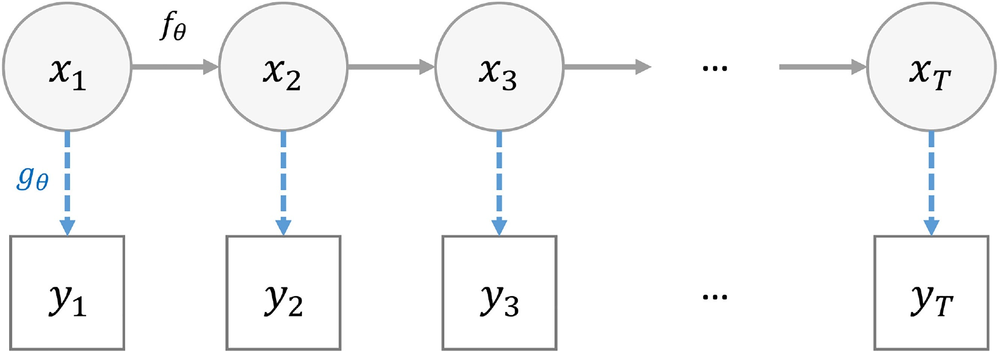
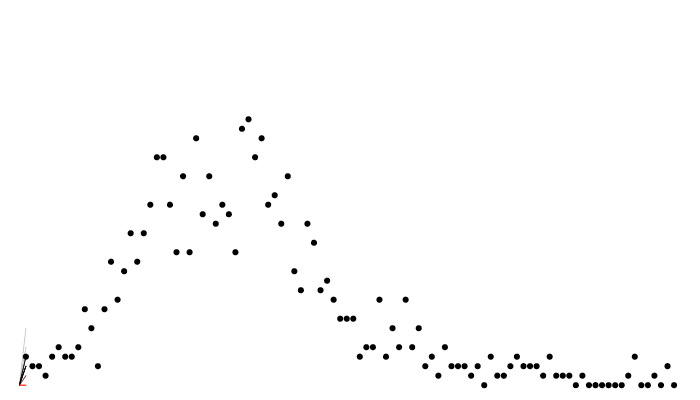

```{r}
#| include: false
#| cache: false
set.seed(1)
source("common.R")
options(monty.progress = FALSE)
```

## A pragmatic introduction {.smaller}

::: {style="font-size: 1.5em"}

```{r}
library(odin2)
library(dust2)
library(monty)
```

:::

<br> A script containing the code featured in these slides can be downloaded [here](fitting.R).


## Previously, on "Introduction to odin" {.smaller}

* We created some simple compartmental models
* We ran these and observed trajectories over time
* We saw that stochastic models produce a family of trajectories

## The data {.smaller}

We have some data on the daily incidence of cases (the data can be downloaded [here](data/incidence.csv))

::: {style="font-size: 1.5em"}

```{r}
data <- read.csv("data/incidence.csv")
head(data)
```

:::

## The data {.smaller}

::: {style="font-size: 1.5em"}

```{r}
plot(data, pch = 19, col = "red")
```

:::

## Our model {.smaller}

We'll fit these data to a model - estimating the unknown parameters `beta` and `gamma`

::: {style="font-size: 1.5em"}

```{r}
#| echo: false
#| results: "asis"
r_output(model_compile_code("sir", "models/sir-incidence.R"))
```

:::


## Adding likelihood to the model {.smaller}

::: {style="font-size: 1.5em"}

```{r}
#| echo: false
#| results: "asis"
r_output(model_compile_code("sir", "models/sir-compare.R"))
```

```{r}
#| include: false
sir <- odin("models/sir-compare.R")
```

:::


## Adding likelihood to the model {.smaller}

We have added to the model:

::: {style="font-size: 1.5em"}

```r
cases <- data()
cases ~ Poisson(incidence)
```
:::

. . .

We are declaring that

* `cases` is a data variable
* it relates to `incidence` in the model via a Poisson distribution

. . .

Note the two types of equations involving distributions:

* `~` indicates a likelihood relationship
* `<-` is for assignments (that can involve random draws)

Beyond that syntax for distributions is the same.

::: footer
In the book: [Data](https://mrc-ide.github.io/odin-monty/data.html)
:::

## Adding likelihood to the model {.smaller}

You can use data variables on the RHS as well

::: {style="font-size: 1.5em"}

```r
n_positives <- data()
n_tests <- data()
n_positives ~ Binomial(n_tests, prob_positive)
```
:::

and parameters

::: {style="font-size: 1.5em"}

```r
cases <- data()
kappa <- parameter()
cases ~ NegativeBinomial(size = kappa, mean = incidence)
```
:::

The distributions supported for likelihoods are the same as those supported for random draws - a full list with their names and parameterisations can be found [here](https://mrc-ide.github.io/odin2/articles/functions.html#distribution-functions).

::: footer
In the book: [Data](https://mrc-ide.github.io/odin-monty/data.html)
:::

## State space models {.smaller}


- A state space model (SSM) is a mathematical framework for modelling a dynamical system.
- It is built around two processes:
    - **state equations** that describes the evolution of some latent variables (also referred as "hidden" states) over time
    - **observation equations** that relates the observations to the latent variables.

## Can you be more precise? {.smaller}



- $x_{t, 1 \leq t \leq T}$ the hidden states of the system
- $y_{t, 1 \leq t \leq T}$ the observations
- $f_{\theta}$ the state transition function
- $g_{\theta}$ the observation (likelihood) function
- $t$ is often time
- $\theta$ defines the model

## Two common problems {.smaller}


- Two common needs
  - "Filtering" i.e. estimate the hidden states $x_{t}$ from the observations $y_t$
  - "Inference" i.e. estimate the $\theta$'s compatible with the observations $y_{t}$

## Sequential Monte Carlo (SMC) {.smaller}

AKA, the (bootstrap) particle filter

- Assuming a given $\theta$, at each time step $t$ it
  1. generates $X_{t+1}^N$ by using $f_{\theta}(X_{t+1}^N|X_{t}^N)$ (the $N$ particles)
  2. calculates weights for the newly generated states based on $g_{\theta}(Y_{t+1}|X_{t+1})$
  3. resamples the states to keep only the good ones

- Allows to efficiently explore the state space by progressively integrating the data points

- Produces a Monte Carlo approximation of $p(Y_{1:T}|\theta)$ the marginal likelihood

## Calculating likelihood: particle filtering {.smaller}



## Calculating likelihood {.smaller}

::: {style="font-size: 1.5em"}

```{r}
data <- dust_filter_data(data, time = "time")
filter <- dust_filter_create(sir, data = data, time_start = 0,
                             n_particles = 200, dt = 0.25)
dust_likelihood_run(filter, list(beta = 0.4, gamma = 0.2))
```

:::

. . .

The system runs stochastically, and the likelihood is different each time:

::: {style="font-size: 1.5em"}

```{r}
dust_likelihood_run(filter, list(beta = 0.4, gamma = 0.2))
dust_likelihood_run(filter, list(beta = 0.4, gamma = 0.2))
```

:::

## Filtered trajectories {.smaller}

::: {.panel-tabset}

#### Code

::: {style="font-size: 1.5em"}

```r
dust_likelihood_run(filter, list(beta = 0.4, gamma = 0.2),
                    save_trajectories = TRUE)
y <- dust_likelihood_last_trajectories(filter)
y <- dust_unpack_state(filter, y)
matplot(data$time, t(y$incidence), type = "l", col = "#00000044", lty = 1,
        xlab = "Time", ylab = "Incidence")
points(data, pch = 19, col = "red")
```

:::


#### Plot

```{r}
#| echo: false
d <- dust_likelihood_run(filter, list(beta = 0.4, gamma = 0.2),
                         save_trajectories = TRUE)
y <- dust_likelihood_last_trajectories(filter)
y <- dust_unpack_state(filter, y)
matplot(data$time, t(y$incidence), type = "l", col = "#00000044", lty = 1,
        xlab = "Time", ylab = "Incidence")
points(data, pch = 19, col = "red")
```

:::

# Particle MCMC (PMCMC) {.smaller}

- PMCMC is an algorithm which performs "filtering" and "inference"
- A Markov Chain Monte Carlo (MCMC) method for estimating target distributions
- MCMC explores the parameter space by moving randomly making jumps from one value to the next
- In PMCMC, the marginal likelihood is estimated using a particle filter
- One particle trajectory is selected randomly at the end of the particle filter  

# Particle MCMC {.smaller}

So we have a marginal likelihood estimator from our particle filter

. . .

How do we sample from `beta` and `gamma`?

. . .

We need:

* to tidy up our parameters
* to create a prior
* to create a posterior
* to create a sampler

## "Parameters" {.smaller}

* Our filter takes a **list** of `beta` and `gamma`, `pars`
  - it could take all sorts of other things, not all of which are to be estimated
  - some of the inputs might be vectors or matrices
* Our MCMC takes an **unstructured vector** $\theta$
  - we propose a new $\theta^*$ via some kernel, say a multivariate normal requiring a matrix of parameters corresponding to $\theta$
  - we need a prior over $\theta$, but not necessarily every element of `pars`
* Smoothing this over is a massive nuisance
  - some way of mapping from $\theta$ to `pars` (and back again)

## Parameter packers {.smaller}

Our solution, "packers"

::: {style="font-size: 1.5em"}

```{r}
packer <- monty_packer(c("beta", "gamma"))
packer
```

:::

## Parameter packers {.smaller}

We can transform from $\theta$ to a named list:

::: {style="font-size: 1.5em"}

```{r}
packer$unpack(c(0.2, 0.1))
```

:::

and back the other way:

::: {style="font-size: 1.5em"}

```{r}
packer$pack(c(beta = 0.2, gamma = 0.1))
```

:::

## Parameter packers {.smaller}

You can bind fixed parameters by passing them in as a named list as the (optional) `fixed` argument

::: {style="font-size: 1.5em"}

```{r}
packer <- monty_packer(c("beta", "gamma"), fixed = list(I0 = 5))
packer$unpack(c(0.2, 0.1))
```

:::

## Parameter packers {.smaller}

Cope with vector- (or array-) parameters in $\theta$ by declaring their dimensions as a named list passed in as the `array` argument. Fixed array parameters are just included in `fixed`.

::: {style="font-size: 1.5em"}

```{r}
packer <- monty_packer(c("beta", "gamma"),
                       array = list(alpha = 3, delta = c(2, 2)),
                       fixed = list(eta = c(1, 3, 5)))
packer
packer$unpack(c(0.2, 0.1, 0.31, 0.32, 0.33, 0.15, 0.16, 0.17, 0.18))
```

:::

## The monty DSL {.smaller}

Working in a Bayesian framework, we will need to construct a prior distribution model for our parameters.

Introducing the `monty` DSL, similar to odin's:

::: {style="font-size: 1.5em"}

```{r}
prior <- monty_dsl({
  beta ~ Exponential(mean = 0.5)
  gamma ~ Exponential(mean = 0.3)
})
```

:::

The distributions supported in the `monty` DSL are the same as those in `odin2` - a full list with their names and parameterisations can be found [here](https://mrc-ide.github.io/odin2/articles/functions.html#distribution-functions).


::: footer
In the book: [The monty DSL](https://mrc-ide.github.io/odin-monty/monty-dsl.html)
:::

## The monty DSL {.smaller}

The `monty` DSL creates a "monty model"

::: {style="font-size: 1.5em"}

```{r}
prior
```

:::


::: footer
In the book: [The monty DSL](https://mrc-ide.github.io/odin-monty/monty-dsl.html)
:::

## The monty DSL {.smaller}

You can see the parameter names of the created model

::: {style="font-size: 1.5em"}

```{r}
prior$parameters
```

:::

. . .

We can evaluate the (log) density for a given parameter vector (the order of parameters matches the above)

::: {style="font-size: 1.5em"}

```{r}
prior$density(c(0.2, 0.1))
```

:::

compare with computing this density manually:

::: {style="font-size: 1.5em"}

```{r}
dexp(0.2, 1 / 0.5, log = TRUE) + dexp(0.1, 1 / 0.3, log = TRUE)
```

:::

::: footer
In the book: [The monty DSL](https://mrc-ide.github.io/odin-monty/monty-dsl.html)
:::

## The monty DSL {.smaller}

We can direct sample from the model using a `monty_rng` object

::: {style="font-size: 1.5em"}

```{r}
rng <- monty_rng_create()
prior$direct_sample(rng)
```

:::

and evaluate the gradient for a given parameter vector (via [automatic differentiation](https://en.wikipedia.org/wiki/Automatic_differentiation))

::: {style="font-size: 1.5em"}

```{r}
prior$gradient(c(0.2, 0.1))
```

:::

Which can be used for Hamiltonian Monte Carlo (HMC) - more support for this in future!

::: footer
In the book: [The monty DSL](https://mrc-ide.github.io/odin-monty/monty-dsl.html)
:::

## The monty DSL {.smaller}

In the monty DSL you can have the distribution of one parameter depend upon another

::: {style="font-size: 1.5em"}

```{r}
m <- monty_dsl({
  a ~ Normal(0, 1)
  b ~ Normal(a, 1)
})
m
```

:::

::: footer
In the book: [The monty DSL](https://mrc-ide.github.io/odin-monty/monty-dsl.html)
:::

## The monty DSL {.smaller}

Order matters in the `monty` DSL - you cannot have the distribution of a parameter depend upon one defined later, so switching the order in our previous model results in an error

::: {style="font-size: 1.5em"}

```{r}
#| error: true
m <- monty_dsl({
  b ~ Normal(a, 1)
  a ~ Normal(0, 1)
})

```

:::

::: footer
In the book: [The monty DSL](https://mrc-ide.github.io/odin-monty/monty-dsl.html)
:::

## The monty DSL {.smaller}

You can use assignments to help make your code more understandable

::: {style="font-size: 1.5em"}

```{r}
m <- monty_dsl({
  mu <- 10
  sd <- 2
  a ~ Normal(mu, sd)
})
```

:::

these can also be used for intermediate calculations

::: {style="font-size: 1.5em"}

```{r}
#| error: true
m <- monty_dsl({
  a ~ Normal(0, 1)
  b ~ Normal(0, 1)
  mu <- (a + b) / 2
  c ~ Normal(mu, 1)
})

```

:::

::: footer
In the book: [The monty DSL](https://mrc-ide.github.io/odin-monty/monty-dsl.html)
:::


## The monty DSL {.smaller}

You can softcode values by passing them in as a list via `fixed`, e.g.

::: {style="font-size: 1.5em"}

```{r}
m <- monty_dsl({
  alpha ~ Normal(178, 20)
  beta ~ Normal(0, 10)
  sigma ~ Uniform(0, 50)
})
```

:::

can be implemented as

::: {style="font-size: 1.5em"}

```{r}
fixed <- list(alpha_mean = 170, alpha_sd = 20,
              beta_mean = 0, beta_sd = 10,
              sigma_max = 50)
m <- monty_dsl({
  alpha ~ Normal(alpha_mean, alpha_sd)
  beta ~ Normal(beta_mean, beta_sd)
  sigma ~ Uniform(0, sigma_max)
}, fixed = fixed)
```

:::

Note that the `fixed` values cannot be modified after the model object has been created.

::: footer
In the book: [The monty DSL](https://mrc-ide.github.io/odin-monty/monty-dsl.html)
:::


## The monty DSL {.smaller}

The `monty` DSL supports arrays with a similar syntax to `odin`.

::: {style="font-size: 1.5em"}

```{r}
fixed = list(gamma_mean = c(0.3, 0.25, 0.2))
m <- monty_dsl({
  alpha ~ Exponential(mean = 0.5)
  beta[, ] ~ Normal(0, 1)
  gamma[] ~ Exponential(mean = gamma_mean[i])
  dim(beta) <- c(2, 2)
  dim(gamma, gamma_mean) <- 3
}, fixed = fixed, gradient = FALSE)
m
```

:::

::: footer
In the book: [The monty DSL](https://mrc-ide.github.io/odin-monty/monty-dsl.html)
:::

## The monty DSL {.smaller}

* All arrays need a `dim()` equation
* No use of `i`, `j` etc on LHS - indexing on the LHS is implicit
* Support for up to 8 dimensions, with index variables `i`, `j`, `k`, `l`, `i5`, `i6`, `i7`, `i8`

::: {style="font-size: 1.5em"}

```r
beta[, ] ~ Normal(0, 1)
gamma[] ~ Exponential(mean = gamma_mean[i])
```

:::

essentially generates loops

::: {style="font-size: 1.5em"}

```r
for (i in 1:2) {
  for (j in 1:2) {
    beta[i, j] ~ Normal(0, 1)
  }
}
for (i in 1:3) {
  gamma[i] ~ Exponential(mean = gamma_mean[i])
}
```

:::

::: footer
In the book: [The monty DSL](https://mrc-ide.github.io/odin-monty/monty-dsl.html)
:::

## The monty DSL {.smaller}

For flexibility dimensions can be softcoded and passed in via `fixed`

::: {style="font-size: 1.5em"}

```{r}
fixed = list(gamma_mean = c(0.3, 0.25, 0.2),
             n_beta_1 = 2, n_beta_2 = 2, n_gamma = 3)
m <- monty_dsl({
  alpha ~ Exponential(mean = 0.5)
  beta[, ] ~ Normal(0, 1)
  gamma[] ~ Exponential(mean = gamma_mean[i])
  dim(beta) <- c(n_beta_1, n_beta_2)
  dim(gamma, gamma_mean) <- n_gamma
}, fixed = fixed, gradient = FALSE)
m
```

:::

::: footer
In the book: [The monty DSL](https://mrc-ide.github.io/odin-monty/monty-dsl.html)
:::


## The monty DSL {.smaller}

You can define arrays with multiline equations

::: {style="font-size: 1.5em"}

```{r}
fixed = list(n_beta = 5)
m <- monty_dsl({
  beta[1] ~ Exponential(mean = 0.3)
  beta[2:n_beta] ~ Exponential(mean = beta[i - 1])
  dim(beta) <- n_beta
}, fixed = fixed, gradient = FALSE)
```

:::

but collectively the equations need to define all elements of the array, and each element can only be defined once.

::: footer
In the book: [The monty DSL](https://mrc-ide.github.io/odin-monty/monty-dsl.html)
:::

## The monty DSL {.smaller}

Elements of an array can depend upon other elements of the same array that are defined earlier.

We can see that in our previous example

::: {style="font-size: 1.5em"}

```r
beta[1] ~ Exponential(mean = 0.3)
beta[2:5] ~ Exponential(mean = beta[i - 1])
```

:::

which becomes clearer when we think how the loop will be generated

::: {style="font-size: 1.5em"}

```r
beta[1] ~ Exponential(mean = 0.3)
for (i in 2:5) {
  beta[i] ~ Exponential(mean = beta[i - 1])
}
```
:::

::: footer
In the book: [The monty DSL](https://mrc-ide.github.io/odin-monty/monty-dsl.html)
:::


## From a dust filter to a monty model {.smaller}

::: {style="font-size: 1.5em"}

```{r}
filter
```

:::

. . .

Combine a filter and a packer

::: {style="font-size: 1.5em"}

```{r}
packer <- monty_packer(c("beta", "gamma"))
likelihood <- dust_likelihood_monty(filter, packer)
likelihood
```

:::

::: footer
In the book: [Inference](https://mrc-ide.github.io/odin-monty/inference.html)
:::

## Posterior from likelihood and prior {.smaller}

Combine a likelihood and a prior to make a posterior

$$
\underbrace{\Pr(\theta | \mathrm{data})}_{\mathrm{posterior}} \propto \underbrace{\Pr(\mathrm{data} | \theta)}_\mathrm{likelihood} \times \underbrace{P(\theta)}_{\mathrm{prior}}
$$

. . .

::: {style="font-size: 1.5em"}

```{r}
posterior <- likelihood + prior
posterior
```

:::

(remember that addition is multiplication on a log scale)

## Create a sampler {.smaller}

A diagonal variance-covariance matrix (uncorrelated parameters)

::: {style="font-size: 1.5em"}

```{r}
vcv <- diag(2) * 0.2
vcv
```

:::

Use this to create a "random walk" sampler:

::: {style="font-size: 1.5em"}

```{r}
sampler <- monty_sampler_random_walk(vcv)
sampler
```

:::

::: footer
In the book: [Samplers and inference](https://mrc-ide.github.io/odin-monty/samplers.html)
:::

## Let's sample! {.smaller}

We will sample 4 chains, each with 1000 steps

::: {style="font-size: 1.5em"}

```{r, cache = TRUE}
samples <- monty_sample(posterior, sampler, 1000, n_chains = 3)
samples
```

:::

::: footer
In the book: [Inference](https://mrc-ide.github.io/odin-monty/inference.html)
:::

## The result: diagnostics {.smaller}

::: {style="font-size: 1.5em"}

Diagnostics can be used from the `posterior` package

```{r}
## Note: as_draws_df converts samples$pars, and drops anything else in samples
samples_df <- posterior::as_draws_df(samples)
posterior::summarise_draws(samples_df)
```

:::

## The results: parameters {.smaller}

You can use the `posterior` package in conjunction with `bayesplot` (and then also `ggplot2`)

::: {style="font-size: 1.5em"}

```{r}
bayesplot::mcmc_scatter(samples_df)
```

:::

## The result: traceplots {.smaller}

::: {style="font-size: 1.5em"}

```{r}
bayesplot::mcmc_trace(samples_df)
```

:::

## The result: density over time {.smaller}

::: {style="font-size: 1.5em"}

```{r}
matplot(drop(samples$density),
        type = "l", lty = 1, ylab = "density")
```

:::

## The result: density over time {.smaller}

::: {style="font-size: 1.5em"}

```{r}
matplot(drop(samples$density[-(1:100), ]), 
        type = "l", lty = 1, ylab = "density")
```

:::

## Better mixing {.smaller}

```{r, cache = TRUE}
vcv <- matrix(c(0.01, 0.005, 0.005, 0.005), 2, 2)
sampler <- monty_sampler_random_walk(vcv)
samples <- monty_sample(posterior, sampler, 2000, initial = samples,
                        n_chains = 4)
matplot(drop(samples$density),
        type = "l", lty = 1, ylab = "density")
```

## Better mixing: the results {.smaller}

::: {style="font-size: 1.5em"}

```{r}
samples_df <- posterior::as_draws_df(samples)
posterior::summarise_draws(samples_df)
```

:::

## Better mixing: the results {.smaller}

::: {style="font-size: 1.5em"}

```{r}
bayesplot::mcmc_scatter(samples_df)
```

:::

## Better mixing: the results {.smaller}

::: {style="font-size: 1.5em"}

```{r}
bayesplot::mcmc_trace(samples_df)
```

:::

# Parallelism {.smaller}

Two places to parallelise

* among particles in your filter
* between chains in the sample

e.g., 4 threads per filter x 2 workers = 8 total cores in use

::: footer
In the book: [Parallelisation](https://mrc-ide.github.io/odin-monty/parallel.html)
:::

## Configure the filter {.smaller}

Use the `n_threads` argument, here for 4 threads

::: {style="font-size: 1.5em"}

```{r}
filter <- dust_filter_create(sir, data = data, time_start = 0,
                             n_particles = 200, dt = 0.25, n_threads = 4)
```

:::

requires that you have OpenMP.

::: footer
In the book: [Parallelisation](https://mrc-ide.github.io/odin-monty/parallel.html)
:::

## Configure a parallel runner {.smaller}

Use `monty_runner_callr`, here for 2 workers

::: {style="font-size: 1.5em"}

```{r}
runner <- monty_runner_callr(2)
```

:::

Pass `runner` through to `monty_sample`:

::: {style="font-size: 1.5em"}

```{r, eval = FALSE}
samples <- monty_sample(posterior, sampler, 1000,
                        runner = runner, n_chains = 4)
```

:::

::: footer
In the book: [Parallelisation](https://mrc-ide.github.io/odin-monty/parallel.html)
:::

## Run chains on different cluster nodes {.smaller}

::: {style="font-size: 1.5em"}

```r
monty_sample_manual_prepare(posterior, sampler, 10000, "mypath",
                            n_chains = 10)
```

:::

Then run these chains in parallel on your cluster:

::: {style="font-size: 1.5em"}

```r
monty_sample_manual_run(1, "mypath")
monty_sample_manual_run(2, "mypath")
monty_sample_manual_run(3, "mypath")
```

:::

And retrieve the result

::: {style="font-size: 1.5em"}

```r
samples <- monty_sample_manual_collect("mypath")
```

:::

::: footer
In the book: [Parallelisation](https://mrc-ide.github.io/odin-monty/parallel.html)
:::


## Saving history {.smaller}

* Save your trajectories at every collected sample
* Save the final state at every sample (for onward simulation)
* Save snapshots at intermediate timepoints of the state at every sample (for counterfactuals)

We look at how to do onward simulation and counterfactuals later.

## Trajectories {.smaller}

::: {style="font-size: 1.5em"}

```{r, cache = TRUE}
likelihood <- dust_likelihood_monty(filter, packer,
                                    save_trajectories = TRUE)
posterior <- likelihood + prior
samples <- monty_sample(posterior, sampler, 1000, n_chains = 4)
```

:::

## Trajectories {.smaller}

::: {.panel-tabset}

#### Code

::: {style="font-size: 1.5em"}

```r
trajectories <- dust_unpack_state(filter,
                                  samples$observations$trajectories)
matplot(data$time, trajectories$incidence[, , 1], type = "l", lty = 1,
        col = "#00000044", xlab = "Time", ylab = "Infection incidence")
points(data, pch = 19, col = "red")
```

:::

#### Plot

```{r, cache = TRUE}
#| echo: false
trajectories <- dust_unpack_state(filter,
                                  samples$observations$trajectories)
matplot(data$time, trajectories$incidence[, , 1], type = "l", lty = 1,
        col = "#00000044", xlab = "Time", ylab = "Infection incidence")
points(data, pch = 19, col = "red")
```

:::


## Trajectories {.smaller}

Trajectories are 4-dimensional

::: {style="font-size: 1.5em"}

```{r}
# (4 states x 20 time points x 1000 samples x 4 chains)
dim(samples$observations$trajectories)
```

:::

These can get very large quickly - there are two main ways to help reduce this:

* Saving only a subset of the states
* Thinning

## Saving a subset of trajectories {.smaller}

You can save a subset via specifying a named vector

::: {style="font-size: 1.5em"}

```{r, cache = TRUE}
likelihood <- dust_likelihood_monty(filter, packer, 
                                    save_trajectories = c("I", "incidence"))
posterior <- likelihood + prior
samples2 <- monty_sample(posterior, sampler, 100, initial = samples)
dim(samples2$observations$trajectories)
```

:::

## Thinning {.smaller}

::: {style="font-size: 1.5em"}

While running

```r
samples <- monty_sample(...,
                        burnin = 100,
                        thinning_factor = 2)
```

:::

After running

::: {style="font-size: 1.5em"}

```{r}
samples <- monty_samples_thin(samples,
                              burnin = 500,
                              thinning_factor = 2)
```

:::

* Thinning while running faster and uses less memory
* After running is more flexible (e.g. can plot full chains of parameters between running and thinning)


## Dealing with sticky chains {.smaller}

* Chains can get stuck when the variance of the marginal likelihood estimate is large
* The chain has obtained a high-end marginal likelihood estimate at one parameter set and needs another high-end estimate at another parameter set to accept
* You can increase the number of particles to reduce variance, but note this will take longer to run
* In `monty_sampler_random_walk` you can rerun the particle filter at the current parameter set with the aim of calculating a lower estimate
  - `rerun_every` sets how often you rerun (`rerun_every = 1000` means once every 1000 iterations)
  - `rerun_random` defines whether this occurs randomly (TRUE) or at fixed intervals (FALSE)
  - using the rerun comes at cost of some bias in the results
  - also some extra runtime cost (increasing the more frequently you rerun)


## Deterministic models from stochastic {.smaller}

* Stochastic models written in odin, can be run deterministically
* Runs by taking the expectation of any random draws
* This gives two models for the price of one
* However it might not be suitable for all models

## Fitting in deterministic mode {.smaller}

The key difference is to use `dust_unfilter_create`

::: {style="font-size: 1.5em"}

```{r}
unfilter <- dust_unfilter_create(sir, data = data, time_start = 0, dt = 0.25)
```

:::

Note as this is deterministic it produces the same likelihood every time

::: {style="font-size: 1.5em"}

```{r}
dust_likelihood_run(unfilter, list(beta = 0.4, gamma = 0.2))
dust_likelihood_run(unfilter, list(beta = 0.4, gamma = 0.2))
```

:::

You should use the same setup if you have an ODE model (which is automatically deterministic)

## Fitting in deterministic mode {.smaller}

::: {style="font-size: 1.5em"}

```{r, cache = TRUE}
likelihood <- dust_likelihood_monty(unfilter, packer, save_trajectories = TRUE)
posterior <- likelihood + prior
samples_det <- monty_sample(posterior, sampler, 1000, n_chains = 4)
samples_det <- monty_samples_thin(samples_det,
                                  burnin = 500,
                                  thinning_factor = 2)
```

:::

## Stochastic v deterministic comparison {.smaller}

::: {.panel-tabset}

#### Code

::: {style="font-size: 1.5em"}

```r
y <- dust2::dust_unpack_state(filter, samples$observations$trajectories)
incidence <- array(y$incidence, c(20, 1000))
matplot(data$time, incidence, type = "l", lty = 1, col = "#00000044",
        xlab = "Time", ylab = "Infection incidence", ylim = c(0, 75),
        main = "Stochastic fit")
points(data, pch = 19, col = "red")

y <- dust2::dust_unpack_state(unfilter, samples_det$observations$trajectories)
incidence <- array(y$incidence, c(20, 1000))
matplot(data$time, incidence, type = "l", lty = 1, col = "#00000044",
        xlab = "Time", ylab = "Infection incidence", ylim = c(0, 75),
        main = "Deterministic fit")
points(data, pch = 19, col = "red")
```

:::


#### Plot 1

```{r, cache = TRUE}
#| echo: false
y <- dust2::dust_unpack_state(filter, samples$observations$trajectories)
incidence <- array(y$incidence, c(20, 1000))
matplot(data$time, incidence, type = "l", lty = 1, col = "#00000044",
        xlab = "Time", ylab = "Infection incidence", ylim = c(0, 75),
        main = "Stochastic fit")
points(data, pch = 19, col = "red")
```

#### Plot 2

```{r, cache = TRUE}
#| echo: false
y <- dust2::dust_unpack_state(unfilter, samples_det$observations$trajectories)
incidence <- array(y$incidence, c(20, 1000))
matplot(data$time, incidence, type = "l", lty = 1, col = "#00000044",
        xlab = "Time", ylab = "Infection incidence", ylim = c(0, 75),
        main = "Deterministic fit")
points(data, pch = 19, col = "red")
```

:::


## Stochastic v deterministic comparison {.smaller}

::: {.panel-tabset}

#### Code

::: {style="font-size: 1.5em"}

```r
pars_stochastic <- array(samples$pars, c(2, 500))
pars_deterministic <- array(samples_det$pars, c(2, 500))
plot(pars_stochastic[1, ], pars_stochastic[2, ], ylab = "gamma", xlab = "beta",
     pch = 19, col = "blue")
points(pars_deterministic[1, ], pars_deterministic[2, ], pch = 19, col = "red")
legend("bottomright", c("stochastic fit", "deterministic fit"), pch = c(19, 19), 
       col = c("blue", "red"))
```

:::


#### Plot

```{r, cache = TRUE}
#| echo: false
pars_stochastic <- array(samples$pars, c(2, 500))
pars_deterministic <- array(samples_det$pars, c(2, 500))
plot(pars_stochastic[1, ], pars_stochastic[2, ], ylab = "gamma", xlab = "beta",
     pch = 19, col = "blue")
points(pars_deterministic[1, ], pars_deterministic[2, ], pch = 19, col = "red")
legend("bottomright", c("stochastic fit", "deterministic fit"), pch = c(19, 19), 
       col = c("blue", "red"))
```

:::


## Fitting a time-varying parameter {.smaller}

Let's look at another dataset (the file can be downloaded [here](data/incidence2.csv))

::: {style="font-size: 1.5em"}

```{r}
data <- read.csv("data/incidence2.csv")
head(data)
```

:::

## Fitting a time-varying parameter {.smaller}

::: {style="font-size: 1.5em"}

```{r}
plot(data, pch = 19, col = "red")
```

:::

## Fitting a time-varying parameter {.smaller}

We'll fit these data to a model with a piecewise constant `beta` using `interpolate`

::: {style="font-size: 1.5em"}

```{r}
#| echo: false
#| results: "asis"
r_output(model_compile_code("sir", "models/sir-interpolate-compare.R"))
```

```{r}
#| include: false
sir <- odin("models/sir-interpolate-compare.R")
```

:::

## Fitting a time-varying parameter {.smaller}

Let's create our packer - we'll fit `gamma` and 2 values for `beta` (with changepoints at `time = 0` and `time = 20`)

::: {style="font-size: 1.5em"}

```{r}
packer <- monty_packer("gamma", array = list(beta = 2),
                       fixed = list(beta_time = c(0, 20)))
```

:::

## Fitting a time-varying parameter {.smaller}

Let's create our filter and likelihood model

::: {style="font-size: 1.5em"}

```{r}
data <- dust_filter_data(data, time = "time")
filter <- dust_filter_create(sir, data = data, time_start = 0,
                             n_particles = 200, dt = 0.25)
likelihood <- dust_likelihood_monty(filter, packer, save_trajectories = TRUE)
```

:::

and create a prior model. then combine to create our posterior model

::: {style="font-size: 1.5em"}

```{r}
prior <- monty_dsl({
  beta[] ~ Exponential(mean = 0.3)
  gamma ~ Exponential(mean = 0.1)
  dim(beta) <- n_beta
}, fixed = list(n_beta = 2), gradient = FALSE)
```

:::

## Fitting a time-varying parameter {.smaller}

Combine to create our posterior model

::: {style="font-size: 1.5em"}

```{r}
posterior <- likelihood + prior
posterior
```

:::

Create a sampler and then sample

::: {style="font-size: 1.5em"}

```{r, cache = TRUE}
vcv <- diag(c(0.005, 0.01, 0.01))
sampler <- monty_sampler_random_walk(vcv)
samples <- monty_sample(posterior, sampler, 1000, initial = c(0.1, 0.5, 0.5), n_chains = 4)
samples <- monty_samples_thin(samples, thinning_factor = 2, burnin = 500)
```

:::

## Fitting a time-varying parameter {.smaller}

::: {.panel-tabset}

#### Code

::: {style="font-size: 1.5em"}

```r
y <- dust_unpack_state(filter, samples$observations$trajectories)
incidence <- array(y$incidence, c(50, 1000))
matplot(data$time, incidence, type = "l", lty = 1,
        col = "#00000044", xlab = "Time", ylab = "Infection incidence")
points(data, pch = 19, col = "red")
```

:::

#### Plot

```{r, cache = TRUE}
#| echo: false
y <- dust_unpack_state(filter, samples$observations$trajectories)
incidence <- array(y$incidence, c(50, 1000))
matplot(data$time, incidence, type = "l", lty = 1,
        col = "#00000044", xlab = "Time", ylab = "Infection incidence")
points(data, pch = 19, col = "red")
```

:::


## Fitting to vector/array data {.smaller}

Suppose we have some data on the daily incidence of cases by age group (the file can be downloaded [here](data/incidence-age.csv))

::: {style="font-size: 1.5em"}

```{r}
data_age <- read.csv("data/incidence-age.csv")
head(data_age)
```

:::

<br> Let's think of the cases data at each time point as a vector of length 2 (for the 2 age groups)

## Fitting to vector/array data {.smaller}

We'll fit these data to a model with age stratification

::: {style="font-size: 1.5em"}

```{r}
#| echo: false
#| results: "asis"
r_output(model_compile_code("sir_age", "models/sir-age-compare.R"))
```

```{r}
#| include: false
sir_age <- odin("models/sir-age-compare.R")
```

:::


## Fitting to vector/array data {.smaller}

We are treating the data `cases` as a vector that relates to `incidence` from the model

::: {style="font-size: 1.5em"}

```r
cases <- data()
dim(cases) <- n_age
cases[] ~ Poisson(incidence[i])
```

:::

* We can extend this to higher-dimensional arrays
* All datastreams that are arrays require `dim()` equations


::: footer
In the book: [Data](https://mrc-ide.github.io/odin-monty/data.html)
:::

## Formatting array data in the data frame {.smaller}

Normally, you could setup a data.frame by writing:

::: {style="font-size: 1.5em"}

```{r}
data.frame(time = c(1, 2, 3, 4), cases = c(0, 4, 6, 10))
```

:::

## Formatting array data in the data frame {.smaller}

Array data can be handled with a list-column.

For a list-column you pass in a list with the same number of elements as there are rows, with each list element being an array of the right size

::: {style="font-size: 1.5em"}

```{r}
data.frame(time = c(1, 2, 3, 4),
           cases = I(list(c(0, 1), c(4, 3), c(6, 7), c(10, 11))))
```

:::

Note we need to wrap with `I()`!

::: footer
In the book: [Data](https://mrc-ide.github.io/odin-monty/data.html)
:::

## Formatting array data in the data frame {.smaller}

Let's convert our case columns to a single list-column (and then drop the separated case columns)

::: {style="font-size: 1.5em"}

```{r}
data_age$cases <- I(asplit(data_age[, c("cases_children", "cases_adult")], 1))
data_age$cases_children <- NULL
data_age$cases_adult <- NULL
head(data_age)
```

:::

## Fitting the age-stratified model {.smaller}

Let's create our packer - we'll fit `beta` and `gamma` and assume we know everything else

::: {style="font-size: 1.5em"}

```{r}
packer <- monty_packer(c("beta", "gamma"),
                       fixed = list(S0 = c(990, 1000),
                                    I0 = c(10, 0),
                                    m = matrix(c(1.8, 0.4, 0.4, 1.2) / 2000, 2, 2),
                                    n_age = 2))
```

:::

## Fitting the age-stratified model {.smaller}

Let's create our filter and likelihood model

::: {style="font-size: 1.5em"}

```{r}
data_age <- dust_filter_data(data_age, time = "time")
filter <- dust_filter_create(sir_age, data = data_age, time_start = 0,
                             n_particles = 200, dt = 0.25)
likelihood <- dust_likelihood_monty(filter, packer, save_trajectories = TRUE)
```

:::

and create a prior model, then combine to create our posterior model

::: {style="font-size: 1.5em"}

```{r}
prior <- monty_dsl({
  beta ~ Exponential(mean = 0.3)
  gamma ~ Exponential(mean = 0.1)
})
posterior <- likelihood + prior
```

:::

## Fitting the age-stratified model {.smaller}

Create a sampler and then sample

::: {style="font-size: 1.5em"}

```{r, cache = TRUE}
vcv <- matrix(c(0.01, 0.005, 0.005, 0.005), 2, 2)
sampler <- monty_sampler_random_walk(vcv)
samples <- monty_sample(posterior, sampler, 500, 
                        initial = c(0.3, 0.1), n_chains = 4)
```

:::

## Fitting the age-stratified model {.smaller}

::: {.panel-tabset}

#### Code

::: {style="font-size: 1.5em"}

```r
y <- dust_unpack_state(filter, samples$observations$trajectories)
incidence <- array(y$incidence, c(2, 100, 2000))

matplot(data_age$time, incidence[1, , ], type = "l", col = "#00000044", lty = 1,
        xlab = "Time", ylab = "Incidence (children)")
cases_children <- vapply(data_age$cases, "[[", numeric(1), "cases_children")
points(data_age$time, cases_children, pch = 19, col = "red")

matplot(data_age$time, incidence[2, , ], type = "l", col = "#00000044", lty = 1,
        xlab = "Time", ylab = "Incidence (adults)")
cases_adult <- vapply(data_age$cases, "[[", numeric(1), "cases_adult")
points(data_age$time, cases_adult, pch = 19, col = "red")
```

:::

#### Plot 1

```{r, cache = TRUE}
#| echo: false
y <- dust_unpack_state(filter, samples$observations$trajectories)
incidence <- array(y$incidence, c(2, 100, 2000))

matplot(data_age$time, incidence[1, , ], type = "l", col = "#00000044", lty = 1,
        xlab = "Time", ylab = "Incidence (children)")
cases_children <- vapply(data_age$cases, "[[", numeric(1), "cases_children")
points(data_age$time, cases_children, pch = 19, col = "red")
```

#### Plot 2

```{r, cache = TRUE}
#| echo: false
matplot(data_age$time, incidence[2, , ], type = "l", col = "#00000044", lty = 1,
        xlab = "Time", ylab = "Incidence (adults)")
cases_adult <- vapply(data_age$cases, "[[", numeric(1), "cases_adult")
points(data_age$time, cases_adult, pch = 19, col = "red")
```

:::

## Projections and counterfactuals {.smaller}

Let's use some new data (the file can be downloaded [here](data/schools.csv))

::: {style="font-size: 1.5em"}

```{r}
data <- read.csv("data/schools.csv")
plot(data, pch = 19, col = "red")
```

:::

::: footer
In the book: [Projections and counterfactuals](https://mrc-ide.github.io/odin-monty/counterfactuals.html)
:::

## Projections and counterfactuals {.smaller}

We'll fit the data to an SIS model incorporating schools opening/closing

::: {style="font-size: 1.5em"}

```{r}
#| echo: false
#| results: "asis"
r_output(model_compile_code("sis", "models/sis.R"))
```

```{r}
#| include: false
sis <- odin("models/sis.R")
```

:::

::: footer
In the book: [Projections and counterfactuals](https://mrc-ide.github.io/odin-monty/counterfactuals.html)
:::

## Projections and counterfactuals {.smaller}

::: {style="font-size: 1.5em"}

```{r}
schools_time <- c(0, 50, 60, 120, 130, 170, 180)
schools_open <- c(1,  0,  1,   0,   1,   0,   1)
```

:::

We will

* project forward from the end of the fits (day 150) to day 200
* run a counterfactual where the schools did not reopen on day 60, reopening on day 130

::: footer
In the book: [Projections and counterfactuals](https://mrc-ide.github.io/odin-monty/counterfactuals.html)
:::

## Fitting to the SIS model {.smaller}

::: {style="font-size: 1.5em"}

```{r}
packer <- monty_packer(c("beta0", "gamma", "schools_modifier"),
                       fixed = list(schools_time = schools_time,
                                    schools_open = schools_open))

data <- dust_filter_data(data, time = "time")
filter <- dust_filter_create(sis, time_start = 0, dt = 0.25,
                             data = data, n_particles = 200)

prior <- monty_dsl({
  beta0 ~ Exponential(mean = 0.3)
  gamma ~ Exponential(mean = 0.1)
  schools_modifier ~ Uniform(0, 1)
})

vcv <- diag(c(2e-4, 2e-4, 4e-4))
sampler <- monty_sampler_random_walk(vcv)
```

:::

::: footer
In the book: [Projections and counterfactuals](https://mrc-ide.github.io/odin-monty/counterfactuals.html)
:::

## Fitting to the SIS model {.smaller}

We want to save the end state, and a snapshot at day 60 (where the counterfactual will diverge)

::: {style="font-size: 1.5em"}

```{r, cache = TRUE}
likelihood <- dust_likelihood_monty(filter, packer, save_trajectories = TRUE,
                                    save_state = TRUE, save_snapshots = 60)

posterior <- likelihood + prior

samples <- monty_sample(posterior, sampler, 500, initial = c(0.3, 0.1, 0.5),
                        n_chains = 4)
samples <- monty_samples_thin(samples, burnin = 100, thinning_factor = 8)
```

:::

::: footer
In the book: [Projections and counterfactuals](https://mrc-ide.github.io/odin-monty/counterfactuals.html)
:::

## Fit to data {.smaller}

::: {.panel-tabset}

#### Code

::: {style="font-size: 1.5em"}

```r
y <- dust_unpack_state(filter, samples$observations$trajectories)
incidence <- array(y$incidence, c(150, 200))
matplot(data$time, incidence, type = "l", col = "#00000044", lty = 1,
        xlab = "Time", ylab = "Incidence")
points(data, pch = 19, col = "red")

```

:::

#### Plot

```{r, cache = TRUE}
#| echo: false
y <- dust_unpack_state(filter, samples$observations$trajectories)
incidence <- array(y$incidence, c(150, 200))
matplot(data$time, incidence, type = "l", col = "#00000044", lty = 1,
        xlab = "Time", ylab = "Incidence")
points(data, pch = 19, col = "red")
```

:::

::: footer
In the book: [Projections and counterfactuals](https://mrc-ide.github.io/odin-monty/counterfactuals.html)
:::

## Running projection using the end state {.smaller}

::: {style="font-size: 1.5em"}

```{r, cache = TRUE}
state <- array(samples$observations$state, c(3, 200))
pars <- array(samples$pars, c(3, 200))
pars <- lapply(seq_len(200), function(i) packer$unpack(pars[, i]))

sys <- dust_system_create(sis, pars, n_groups = length(pars), dt = 1)

dust_system_set_state(sys, state)
t <- seq(150, 200)
y <- dust_system_simulate(sys, t)
y <- dust_unpack_state(sys, y)
```

:::

::: footer
In the book: [Projections and counterfactuals](https://mrc-ide.github.io/odin-monty/counterfactuals.html)
:::

## Running projection using the end state {.smaller}

::: {.panel-tabset}

#### Code

::: {style="font-size: 1.5em"}

```r
matplot(data$time, incidence, type = "l", col = "#00000044", lty = 1,
        xlab = "Time", ylab = "Incidence", xlim = c(0, 200))
matlines(t, t(y$incidence), col = "blue")
points(data, pch = 19, col = "red")
```

:::

#### Plot

```{r, cache = TRUE}
#| echo: false
matplot(data$time, incidence, type = "l", col = "#00000044", lty = 1,
        xlab = "Time", ylab = "Incidence", xlim = c(0, 200))
matlines(t, t(y$incidence), col = "blue")
points(data, pch = 19, col = "red")
```

:::

::: footer
In the book: [Projections and counterfactuals](https://mrc-ide.github.io/odin-monty/counterfactuals.html)
:::

## Running counterfactual using the snapshot {.smaller}

::: {style="font-size: 1.5em"}

```{r, cache = TRUE}
snapshot <- array(samples$observations$snapshots, c(3, 200))
pars <- array(samples$pars, c(3, 200))
f <- function(i) {
  p <- packer$unpack(pars[, i])
  p$schools_time <- c(0, 50, 130, 170, 180)
  p$schools_open <- c(1, 0, 1, 0, 1)
  p
}
pars <- lapply(seq_len(200), f)
sys <- dust_system_create(sis, pars, n_groups = length(pars), dt = 1)

dust_system_set_state(sys, snapshot)
t <- seq(60, 150)
y <- dust_system_simulate(sys, t)
y <- dust_unpack_state(sys, y)
```

:::

::: footer
In the book: [Projections and counterfactuals](https://mrc-ide.github.io/odin-monty/counterfactuals.html)
:::

## Running counterfactual using the snapshot {.smaller}

::: {.panel-tabset}

#### Code

::: {style="font-size: 1.5em"}

```r
matplot(data$time, incidence, type = "l", col = "#00000044", lty = 1,
        xlab = "Time", ylab = "Incidence")
matlines(t, t(y$incidence), col = "blue")
points(data, pch = 19, col = "red")
```

:::

#### Plot

```{r, cache = TRUE}
#| echo: false
matplot(data$time, incidence, type = "l", col = "#00000044", lty = 1,
        xlab = "Time", ylab = "Incidence")
matlines(t, t(y$incidence), col = "blue")
points(data, pch = 19, col = "red")
```

:::

::: footer
In the book: [Projections and counterfactuals](https://mrc-ide.github.io/odin-monty/counterfactuals.html)
:::

# Next steps {.smaller}

Try different samplers

* adaptive sampler (for deterministic models)

Some under development to support odin models

* Hamiltonian Monte Carlo (HMC)
* parallel tempering
* nested sampler for grouped models
